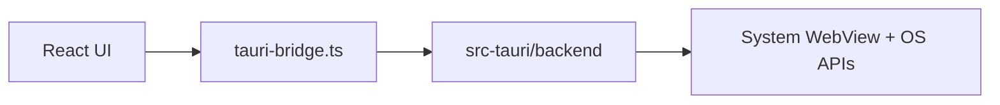

# Pure Tauri migration

**Goal:** Zeus on Tauri with a **100% Rust backend**.

Electron remains on this branch via `npm run electron:dev`. Tauri uses `npm run tauri:dev`.

**Status:** IPC parity complete — `npm run typecheck` and `cargo build` pass warning-free. Remaining work is release signing and feed config for live Tauri updates, not app features.

## Architecture



## Rust port status

### ✅ Ported (pure Rust)

| Area | Channels |
|------|----------|
| TCP fixed reader | connect, disconnect, send, cancel, events |
| Handheld server | start/stop, send EPCs, send recipe (SGTIN-96), cancel, is-running |
| MySQL database tab | connect, CRUD, query, export (in-memory + streaming to path), schema, import |
| Local FS | readdir, write base64, path parent |
| ALE / ITX | ale-request, ale-batch, credential meta, itx-api-request |
| Labelary, OCR, custom TCP | render, send |
| Safe store, API config, admin | encrypted secrets, login |
| App preferences | auto-update toggle (file-backed) |
| Install registry | status, enable, send-now |
| **SFTP** (18 channels) | `russh` + `russh-sftp` — connect, readdir, read/write, mkdir, rename, unlink, rmrf, stat, find, transfer progress |
| **Net scan** | `if-addrs`, `tokio::process` (ping), `dns-lookup` — CIDR/range/allSubnets, host events |
| **UDP Edge discovery** | `tokio::net::UdpSocket` — listen, probe, heartbeat parse |
| **Reader discovery** | TCP port probe, LLRP PEN, HTTP fingerprint — CIDR/range/allSubnets |
| **Log aggregator** | Zip extract, classify/organize Edge logs, merge categories, progress events |
| **Admin terminal** | `portable-pty` — shell-start/write/resize/kill + shell-data/exit events |
| **Pop-out windows** | Tauri multi-window — open/dock/broadcast, init state, popout-closed events |
| **Auto-updater** | `tauri-plugin-updater` — check/download/install; startup + 4h interval; dev skips check |
| Window + dialogs | minimize/maximize/close, native save/open |

### 🚧 Release config (Tauri updates)

Set in `.env` for packaged builds:

- `ZEUS_RELEASE_OWNER` / `ZEUS_RELEASE_REPO` — GitHub release feed
- `ZEUS_UPDATER_PUBKEY` — minisign public key from `tauri signer generate` (also set `plugins.updater.pubkey` in `tauri.conf.json` before `tauri:build`)

Without the pubkey, manual check reports a configuration error in Settings.

## Environment (`.env`)

Tauri loads `modern-ui/.env` at:

- **Dev:** `scripts/tauri-dev.mjs` passes vars to the Tauri process
- **Runtime:** Rust `load_dotenv()` on startup
- **Build:** `src-tauri/build.rs` bakes `ZEUS_ALE_*` / registry vars into the binary (same as Electron embed)

Use `ZEUS_ALE_USERNAME` / `ZEUS_ALE_PASSWORD` (or `VITE_ALE_*` legacy) in `.env`. Restart `npm run tauri:dev` after changing credentials.


```powershell
npm run electron:dev   # Electron (unchanged)
npm run tauri:dev      # Pure Rust backend
npm run tauri:build    # Native installer (~15–40 MB target when complete)
```

## Branch

All work on **`tauri-migration`**.
